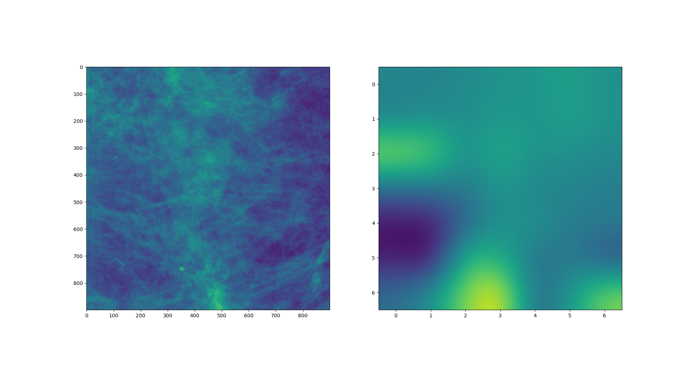

# Breast Mass Detection

An implementation and a review of the paper "A Deep Learning Approach for
Breast Cancer Mass Detection", but with some cut corners.

# Dataset

Manually download the dataset and extract it in an internal directory `dataset`:

[Patched DDSM-CBIS](https://www.kaggle.com/llkihn/ddsm-cbis-patch)

# Run

Train the model and view a sample class activation map:

```
python main.py
```

Skip training and use a previously trained checkpoint saved model:

```
python main.py --skip-training
```

# Sample


